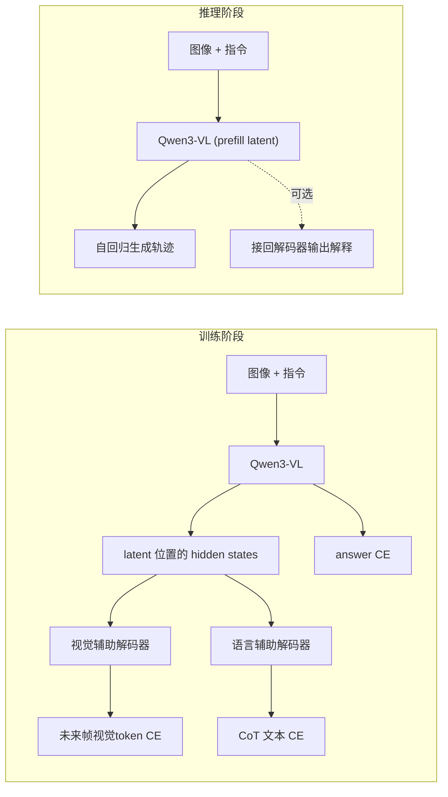

# OneVL 论文详细解读

> OneVL: One-Step Latent Reasoning and Planning with Vision-Language Explanations
> （基于项目 `OneVL/infer/README.md`、技术报告与开源代码整理）

本篇面向工程实现，目标是把论文动机、方法、训练范式与"代码里到底发生了什么"对应起来，为后续阅读 [02-原始实现讲解](02-original-implementation.md) 与 [03-非侵入式复现](03-noninvasive-reproduction.md) 打基础。

---

## 1. 背景：自动驾驶里的"思维链"困境

OneVL 面向**端到端自动驾驶轨迹规划**（Vision-Language-Action, VLA）。它的骨干是多模态大模型 **Qwen3-VL-4B-Instruct**：输入是前视相机图像 + 文本指令，输出是未来若干个路点（waypoints）构成的轨迹。

引入"思维链（Chain-of-Thought, CoT）"能显著提升规划质量与可解释性，但存在一个根本矛盾：

- **Explicit CoT（显式思维链）**：先生成一大段自然语言推理，再给出答案。可解释、精度高，但**自回归生成推理文本非常慢**，对实时驾驶不可接受。
- **Implicit CoT（隐式思维链）**：把推理压缩进若干个不可读的"latent 向量"（如 COCONUT / CODI / SIM-CoT）。推理快，但**latent 不可解释**，而且论文发现：在驾驶任务上，这些隐式方法的精度**甚至打不过"直接给答案"的基线**。

OneVL 的目标：**既要 implicit 的速度，又要 explicit 的可解释性，并且精度还要更高。**

---

## 2. 三种 CoT 范式对比

| 范式 | 推理形态 | 速度 | 可解释性 | 驾驶任务精度 |
|------|----------|------|----------|--------------|
| (a) Explicit CoT | 完整推理文本 → 答案 | 慢 | 语言可解释 | 高 |
| (b) Implicit CoT | 不透明 latent 向量 → 答案 | 快 | 不可解释 | 偏低（常不如纯答案基线） |
| (c) **OneVL（本文）** | 视觉 latent `v` + 语言 latent `l` → 答案 | 快（与纯答案相当） | **视觉 + 语言双可解释** | **最高** |

OneVL 的关键洞察：**用"辅助解码器（auxiliary decoder）"在训练时给 latent 注入语义**，让 latent 既紧凑（推理时可直接 prefill，速度快），又"有内容可被解码出来"（训练时被强制对齐到推理文本和未来场景），从而推理时丢弃解码器也不损失能力。

---

## 3. 核心方法

### 3.1 Latent Token Interface（潜变量接口）

在 assistant 回复的**答案之前**插入一小段 latent token：

```
<|start-latent-vis|> <|latent-vis|> x4 <|end-latent-vis|>   ← 4 个视觉 latent
<|start-latent|>     <|latent|>     x2 <|end-latent|>       ← 2 个语言 latent
<answer> [ ...轨迹... ]
```

- **视觉 latent token（4 个）**：承载"未来场景动态"的压缩表示。
- **语言 latent token（2 个）**：承载"语言推理（CoT）"的压缩表示。
- 关键工程点：**不新增词表 special token**，而是复用已有词表把 `<|latent|>` 等标记拆成子词序列（`use_original_vocab=true`）。这样无需 resize embedding、无需改 tokenizer，迁移更平滑。论文/代码里通过对 `|`、`latent`、`-vis`、`start`、`end`、`-lat`、`ent` 等子词做"模式匹配"来定位 latent 区域。

这些 latent token 的位置在 forward 后会取出对应的 **last hidden state**，作为两个辅助解码器的输入。

### 3.2 Visual Auxiliary Decoder（视觉辅助解码器，"世界模型"监督）

- 作用：从**视觉 latent 的 hidden state** 出发，预测**未来帧的视觉 token**（t+0.5s 与 t+1.0s 两帧）。
- 未来帧的"视觉 token"来自 **Emu3.5 IBQ 视觉 tokenizer**（codebook 大小约 131k），即把图像离散化成一串 token，让语言模型式的解码器去自回归预测。
- 含义：它充当一个 **world model（世界模型）**，强迫视觉 latent 编码"接下来场景会怎么变化"，把 latent 锚定到真实的物理场景动态上。

### 3.3 Language Auxiliary Decoder（语言辅助解码器，CoT 重建）

- 作用：从**语言 latent 的 hidden state** 出发，重建**显式的 CoT 推理文本**。
- 可选地以 **ViT 视觉特征为条件**（`aux_visual_condition=true`），即把图像 token 的 embedding 拼在 latent 之前一起喂给解码器，使重建出来的推理文本与画面一致。
- 含义：强迫语言 latent 编码人类可读的推理过程。

### 3.4 Prefill Inference（预填充推理）

- 推理时**丢弃两个辅助解码器**；latent token 直接作为 prompt 的一部分被"prefill"（一次并行前向），随后只对轨迹做自回归生成。
- 因此 OneVL 的推理延迟基本等同于"纯答案自回归"，远快于显式 CoT：
  - NAVSIM 上比显式 CoT 快约 **1.5×**，ROADWork 上快约 **2.3×**。
- 如果需要"解释"（debug / 可视化），可以再把训练好的辅助解码器接回来，从 latent 解出 CoT 文本和未来帧——但这只在需要解释时做，不影响主推理速度。

下图概括训练与推理的差异：



---

## 4. 训练范式：分阶段训练（Staged Training）

消融实验显示：**不分阶段训练，性能会从 88.84 崩塌到 67.13**。分阶段是 OneVL 成功的关键。结合开源训练脚本，三个阶段为：

- **Stage 0 — Answer Warmup（答案预热）**
  - 用 `model_type=qwen3_vl`（不挂辅助解码器）在 latent 格式数据上做普通 SFT；`--loss_type latent_cot` 在无辅助解码器时退化为标准交叉熵。
  - 目的：先让模型学会"latent 前缀 → 轨迹答案"的映射。此时 latent 还没有语义。

- **Stage 1 — 训练辅助解码器（冻结主模型）**
  - `LATENT_COT_FREEZE_MAIN_MODEL=true`，只训练两个辅助解码器和投影层。
  - 目的：让 latent 的 hidden state 学会被解码成"CoT 文本"和"未来帧 token"，给 latent 注入语义。

- **Stage 2 — 联合微调（全部解冻）**
  - `LATENT_COT_FREEZE_MAIN_MODEL=false`，主模型 + 辅助解码器一起训练。
  - 目的：让主模型与有语义的 latent 协同，最终既准又能解释。

### 损失函数

训练总损失是三项加权和：

$$
L = L_{\text{answer-CE}} + \lambda_{l} \cdot L_{\text{lang-explain}} + \lambda_{v} \cdot L_{\text{visual-explain}}
$$

- $L_{\text{answer-CE}}$：主模型对答案 token 的交叉熵。
- $L_{\text{lang-explain}}$：语言辅助解码器重建 CoT 文本的交叉熵（权重默认 `1.0`）。
- $L_{\text{visual-explain}}$：视觉辅助解码器预测未来帧 token 的交叉熵（权重默认 `0.1`）。

> 代码层面对应 `compute_explain_loss` / `compute_visual_explain_loss`，详见 [02-原始实现讲解](02-original-implementation.md)。

---

## 5. 关键创新点小结

1. **双模态辅助解码器**：语言辅助解码器恢复可读 CoT；视觉辅助解码器作为"世界模型"预测未来帧，把 latent 锚定到物理场景动态。
2. **Prefill 推理**：latent 一次并行前向，延迟≈纯答案 AR，显著快于显式 CoT。
3. **压缩驱动泛化**：OneVL 是论文测试的四个基准里，**唯一在所有任务上都超过显式自回归 CoT** 的隐式 CoT 方法。

---

## 6. 实验结果（摘自 README）

- **NAVSIM**：PDM-score **88.84**（4B），延迟 4.46s；高于 AR CoT+Answer（88.29 / 6.58s）与所有隐式基线。
- **ROADWork**：ADE **12.49** / FDE **28.80**（px），延迟 4.71s，优于显式 CoT 且快约 2.3×。
- **Impromptu**：ADE **1.34** / FDE **3.70**（m）。
- **APR1**：ADE **2.62**（m）。
- **文本 CoT 质量（NAVSIM）**：语言辅助解码器恢复了约 **97%** 的显式 CoT 质量，却以纯答案速度运行。

### 消融

- 去掉视觉解码器：88.84 → 87.97（仍可观，但下降）。
- 去掉语言解码器：88.84 → 88.53。
- **去掉分阶段训练：88.84 → 67.13（崩塌）** —— 分阶段训练不可省。

---

## 7. 与实现的对应关系（速查）

| 论文概念 | 代码落点（原始 fork） |
|----------|----------------------|
| Latent token 接口 | `latent_cot.py` 的 `LATENT_SPECIAL_TOKENS` 与 `use_original_vocab` 子词模式匹配 |
| 取 latent hidden state | `_latent_cot_forward` 中 `outputs.hidden_states[-1]` + `find_latent_*_positions_from_pattern` |
| 语言辅助解码器 loss | `compute_explain_loss`（输入：ViT 条件 + latent embedding + CoT 文本 token） |
| 视觉辅助解码器 loss | `compute_visual_explain_loss`（目标：未来帧视觉 token） |
| 分阶段冻结 | `apply_latent_cot_freeze` + `LATENT_COT_FREEZE_*` 环境变量 |
| Prefill 推理 | `infer_onevl.py` 的 `assistant_prefix` 注入 + 单次 `model.generate` |
| 接回解码器输出解释 | `decode_latent_with_aux` / `decode_latent_with_visual_aux` |

> 模型权重基于 [Qwen3-VL-4B-Instruct](https://huggingface.co/Qwen/Qwen3-VL-4B-Instruct)，视觉 tokenizer 来自 [Emu3.5-VisionTokenizer](https://huggingface.co/BAAI/Emu3.5-VisionTokenizer)。
