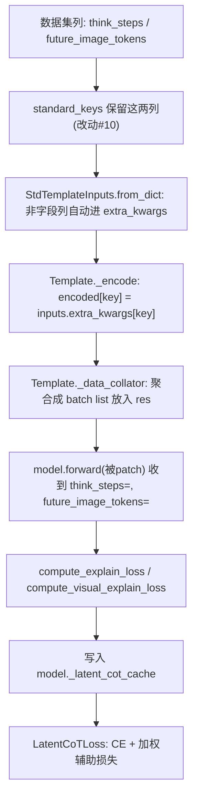

# OneVL 原始实现讲解（train 与 infer）

本篇梳理 OneVL 开源代码"原本是怎么做的"：

- 训练侧 `OneVL/train`：在 **ms-swift 4.1.0.dev0** 上**直接改源码**（侵入式），共 10 处改动。
- 推理侧 `OneVL/infer/infer_onevl.py`：一个**自包含、不依赖训练框架**的独立脚本。

理解这一篇后，再看 [03-非侵入式复现](03-noninvasive-reproduction.md) 就能清楚"哪一处侵入式改动，对应到哪一种非侵入式手段"。

---

## 一、训练侧：10 处侵入式改动

OneVL 把 Latent CoT 能力直接焊进了 swift 源码。核心新增文件是 `swift/model/models/latent_cot.py`（约 1200 行），其余文件围绕它做注册与接线。

### 1. 新增 `swift/model/models/latent_cot.py`（核心算法）

包含全部 Latent CoT 逻辑：

- `LatentCoTConfig`：dataclass，承载全部超参（`c_thought`、`c_thought_visual`、`aux_model_path`、各类 `freeze_*`、`use_original_vocab` 等）。
- `patch_model_for_latent_cot(model, processor, config, model_dir)`：**就地改装模型**——
  1. 处理 latent token（`use_original_vocab=true` 时用子词模式匹配，不加新 token；否则 `add_tokens` + `resize_token_embeddings`）。
  2. 按需构建 `_latent_cot_aux_decoder`（文本辅助解码器）+ `_latent_cot_latent_proj`（投影层）。
  3. 按需构建 `_latent_cot_visual_aux_decoder` + `_latent_cot_visual_latent_proj` + `_latent_cot_visual_aux_tokenizer`。
  4. 用 `MethodType` 把 `model.forward` 替换为 `_latent_cot_forward`（保存原 forward 到 `_origin_forward_for_latent_cot`）。
- `_latent_cot_forward(...)`：被替换上去的 forward。它：
  - 检测 input 是否含 latent；不含则直接走原 forward。
  - 含 latent 且需要时 `output_hidden_states=True`，并注册一个 forward-pre-hook 抓取 **ViT 注入后的 embedding**（供视觉条件）。
  - 取 `hidden_states[-1]`，用 `find_latent_positions_from_pattern` 等定位 latent 位置。
  - 调 `compute_explain_loss` / `compute_visual_explain_loss` 算两路辅助损失。
  - 把三项损失存到 `model._latent_cot_cache`（**注意**：存到 model 而非 outputs，因为 accelerate 的 `convert_to_fp32` 会丢弃 ModelOutput 上的动态属性）。
- `compute_explain_loss(...)`：对每个 latent 分组，把 `[可选ViT条件] + latent_embeds(经proj) + CoT文本embeds` 拼接喂给文本辅助解码器，对 CoT 文本部分算交叉熵。
- `compute_visual_explain_loss(...)`：类似，目标是未来帧视觉 token。
- `apply_latent_cot_freeze(model)`：根据 config 冻结主模型 / 文本解码器 / 视觉解码器。**必须在 ms-swift 的 `prepare_model`（会 `requires_grad_(True)`）之后调用**，否则冻结会被覆盖。
- `load_latent_cot_weights(model, model_dir)`：从 checkpoint 把 `_latent_cot_*` 权重恢复回来（base 架构里没有这些子模块，常规 `from_pretrained` 会悄悄丢弃它们）；DeepSpeed ZeRO-3 下走 `GatheredParameters` 分支。
- 一组 latent 位置检测工具：`_get_latent_pattern_ids`、`_get_marker_component_ids`、`find_latent_positions_from_pattern`、`find_visual_latent_positions_from_pattern`、`find_latent_all_positions_from_pattern`、`_expand_keyword_positions_with_stop`、`_find_text_latent_block_start`、`find_latent_mask_region` 等。

### 2. 新增 `swift/loss/latent_cot.py`（`LatentCoTLoss`）

当使用 `--loss_type latent_cot` 时，trainer 会在调用 `model(**inputs)` 前 **pop 掉 labels**，所以 forward 不算 CE，只算辅助损失并缓存。`LatentCoTLoss.__call__`：

1. 通过 `trainer.model`（解包 DDP/FSDP）拿到 `model._latent_cot_cache`。
2. 自己用 logits + labels 算 shifted 交叉熵（`student_ce_loss`）。
3. 把缓存里的 `explain_loss` / `visual_explain_loss` 按 batch 占比加权后加到总损失。
4. 把三项分量作为自定义 metric 记录。
5. 若 `cache is None`（如 Stage 0 未挂解码器），退化为标准 `per_token_loss_func`。

### 3. 改 `swift/model/models/qwen.py`：新增 Loader + 注册

```python
class Qwen3VLLatentCoTLoader(Qwen3VLLoader):
    def get_model(self, model_dir, config, processor, model_kwargs):
        model = super().get_model(...)                 # 走标准 Qwen3-VL 加载
        # 从 LATENT_COT_* 环境变量构造 LatentCoTConfig
        patch_model_for_latent_cot(model, processor, latent_config, model_dir=model_dir)
        load_latent_cot_weights(model, model_dir)
        return model

register_model(ModelMeta(MLLMModelType.qwen3_vl_latent_cot, [...], Qwen3VLLatentCoTLoader, ...))
```

所有超参通过 `get_env_args('LATENT_COT_*', ...)` 读取——这就是训练脚本里一堆 `export LATENT_COT_*` 的来源。

### 4. 改 `swift/template/templates/qwen.py`：新增 Template + 注册

```python
class Qwen3VLLatentCoTTemplate(Qwen3VLTemplate):
    def _encode(self, inputs):
        encoded = super()._encode(inputs)
        # 1) 把 latent marker 在 labels 中置 -100（除非 LATENT_COT_LATENT_CE_LOSS）
        # 2) 透传 think_steps / future_image_tokens 到 encoded
        ...
    def _data_collator(self, batch, *, padding_to=None):
        # 把 think_steps / future_image_tokens 聚合成 per-batch list 放进 res
        ...
register_template(QwenTemplateMeta(MLLMTemplateType.qwen3_vl_latent_cot, template_cls=..., ...))
```

### 5./6. 改 `swift/model/constant.py` 与 `swift/template/constant.py`

各加一个常量 `qwen3_vl_latent_cot = 'qwen3_vl_latent_cot'`（分别在 `MLLMModelType`、`MLLMTemplateType` 里），供上面的注册引用。

### 7. 改 `swift/loss/mapping.py`

```python
from .latent_cot import LatentCoTLoss
loss_map = { ..., 'latent_cot': LatentCoTLoss }
```

### 8. 改 `swift/pipelines/train/tuner.py`

在 `TunerMixin.prepare_model` 的 `tuner_type == 'full'` 分支末尾：

```python
if getattr(model, '_latent_cot_config', None) is not None:
    from swift.model.models.latent_cot import apply_latent_cot_freeze
    apply_latent_cot_freeze(model)
```

放在 `freeze_parameters` / `activate_parameters` 之后，确保 Latent CoT 的冻结设置不被 `requires_grad_(True)` 覆盖。

### 9. 改 `swift/model/models/__init__.py`

在 models 包导入列表里加入 `latent_cot`，确保该模块作为 side-effect 被 import。

### 10. 改 `swift/dataset/preprocessor/core.py`

把 `think_steps`、`future_image_tokens` 加入 `RowPreprocessor.standard_keys`。**这一步至关重要**：否则数据预处理阶段 `remove_useless_columns` 会用 `select_columns(standard_keys)` 把这两列**直接删掉**，辅助解码器就拿不到监督目标了。

---

## 二、训练数据流：字段如何从数据集流到 forward

数据集每条样本除了常规 `messages` / `images`，还带两列：

- `think_steps`：原始可读的 CoT 推理文本（语言辅助解码器的重建目标）。
- `future_image_tokens`：未来帧视觉 token 的文本表示（视觉辅助解码器的预测目标）。

它们**不进入 input_ids**，只作为辅助解码器的监督目标。流转路径：



要点：

- `StdTemplateInputs.from_dict` 里 `extra_kwargs = {k: v for k, v in inputs.items() if k not in all_keys}`——任何不是标准字段的列都会**自动**落到 `extra_kwargs`。所以模板只要从 `extra_kwargs` 取这两列即可。
- 真正"卡点"是数据预处理阶段的列裁剪，所以必须扩展 `standard_keys`（改动 #10）。

---

## 三、Latent 位置检测（`use_original_vocab` 模式）

由于不新增 special token，`<|latent|>` 等会被 tokenizer 拆成多个子词。OneVL 用"锚点 + 扩展"的方式定位：

1. 预计算锚点 id：`latent`、`|`、`-vis` 的单 token id（`_get_latent_pattern_ids`）。
2. 找文本 latent：满足 `| latent |` 模式的位置（`find_latent_positions_from_pattern`）。
3. 找视觉 latent：满足 `| latent -vis` 模式的位置（`find_visual_latent_positions_from_pattern`）。
4. 必要时（`latent_use_all_subtokens`）从锚点向两侧扩展，覆盖整段 marker 的所有子词（`_expand_keyword_positions_with_stop`，并用对方类型的位置作为停止集，区分文本/视觉块）。
5. `_find_text_latent_block_start` 用 `| start -lat ent |` 且前一个不是 `-vis` 来切分"视觉块"与"文本块"的边界。

`find_latent_mask_region` 则用于在 `_encode` 阶段把整段 latent 区域的 label 置 -100。

---

## 四、推理侧：`OneVL/infer/infer_onevl.py`

这是一个**独立脚本**，不 import 任何训练框架，自己用 `transformers` 加载模型。流程：

1. **加载主模型**：`Qwen3VLForConditionalGeneration.from_pretrained(model_path)`（latent CoT checkpoint，其中也存了辅助解码器权重）。
2. **构造 latent 前缀**（assistant prefix）：

   ```
   <|start-latent-vis|><|latent-vis|>*N_vis<|end-latent-vis|>
   <|start-latent|><|latent|>*N_txt<|end-latent|><answer>[
   ```

   把它接在 `apply_chat_template(..., add_generation_prompt=True)` 的结果之后，作为生成起点。
3. **（可选）辅助解码器解释**：若开启 `--decoder_explain` / `--visual_decoder_explain`：
   - 用 `build_aux_decoder_from_checkpoint` 按前缀（`_latent_cot_aux_decoder.` / `_latent_cot_visual_aux_decoder.`）从 checkpoint 抽取子模块权重，单独构建解码器。
   - 用 `build_projection_from_checkpoint` 重建投影层。
   - 先跑一次 `model(**inputs, output_hidden_states=True)`（用 hook 抓 ViT embedding），用 `compute_inference_latent_positions` 定位 latent，再用 `decode_latent_with_aux` / `decode_latent_with_visual_aux` 自回归解码出 CoT 文本 / 未来帧 token。
4. **生成轨迹**：`model.generate(..., do_sample=False)`，解码出 `<answer>` 之后的轨迹串。
5. **附加统计**：计算 entropy、avg_log_prob、seq_confidence，以及可选 `FloatMLPHead` 直接回归路点。
6. 把 `output_text` / `decoder_explain` / `visual_decoder_explain` / `latency` 等写成 JSON。

辅助函数 `_get_latent_pattern_ids`、`compute_inference_latent_positions` 与训练侧逻辑一致（独立复制了一份）。可视化脚本 `scripts/visualize_predict_image_tokens.py` 再用自带的 `vq_decoder/`（Emu3.5 IBQ）把未来帧 token 解回图像。

---

## 五、小结：侵入点 → 复现手段（预告）

| 原始侵入式改动 | 非侵入式对应（详见 03） |
|----------------|--------------------------|
| 新增 latent_cot.py / loss | 放进插件包，仅改相对 import |
| 改 qwen.py 注册 model | 插件里 `register_model('qwen3_vl_latent_cot')` |
| 改 qwen.py 注册 template | 插件里 `register_template('qwen3_vl_latent_cot')` |
| 改 constant.py 加常量 | 直接用字符串，无需常量 |
| 改 loss/mapping.py | 运行时 `loss_map['latent_cot'] = LatentCoTLoss` |
| 改 tuner.py | monkey-patch `TunerMixin.prepare_model` |
| 改 models/__init__.py | 不需要，入口显式 import |
| 改 dataset/core.py | 运行时 `RowPreprocessor.standard_keys += [...]` |
| 推理脚本 add_assistant_prefix | `swift infer --response_prefix ...` |
| 推理 aux explain | 自定义 explain 模板覆盖 generate/decode |
