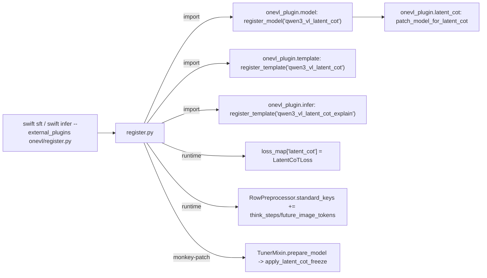

# OneVL 非侵入式复现 - 文档索引

本套文档讲清楚三件事：OneVL 论文在做什么、原始代码怎么实现、以及如何在 ms-swift 4.2.0 里**不改源码**地复现它。

## 阅读顺序

1. [01-OneVL-paper.md](01-OneVL-paper.md) — **论文详细解读**
   - 三种 CoT 范式、Latent Token 接口、视觉/语言双辅助解码器、Prefill 推理、分阶段训练、实验与消融，并给出"论文概念 → 代码落点"对照表。

2. [02-original-implementation.md](02-original-implementation.md) — **原始 train / infer 实现讲解**
   - 训练侧对 ms-swift 的 10 处侵入式改动逐一讲解；训练数据流（`think_steps` / `future_image_tokens` 如何流到 forward）；latent 位置检测；推理脚本 `infer_onevl.py` 的完整流程。

3. [03-noninvasive-reproduction.md](03-noninvasive-reproduction.md) — **非侵入式复现方案与使用说明**
   - external_plugins 机制、文件结构、侵入式→非侵入式映射表、各插件文件说明、训练/推理命令、数据格式、与原版差异与注意事项。

## 代码位置

- 目录位置：`OneVL/custom/onevl/`（与框架 `OneVL/custom/ms-swift-4.2.0/` 平级，框架保持纯净）
- 插件包与入口：`onevl/onevl_plugin/`、`onevl/register.py`
- 训练脚本：`onevl/scripts/train/sft_stage{0,1,2}.sh`
- 推理脚本：`onevl/scripts/infer/infer_navsim{,_explain}.sh`
- 自检脚本：`onevl/selfcheck.py`（运行 `bash onevl/scripts/selfcheck.sh`，由该脚本经 PYTHONPATH 提供导入路径）

## 一图速览

